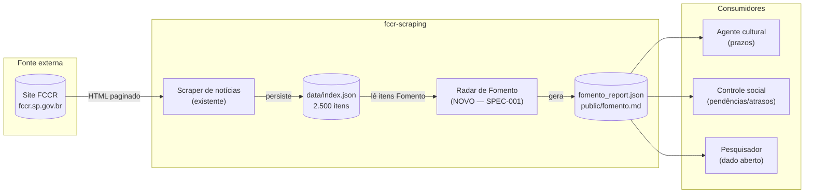
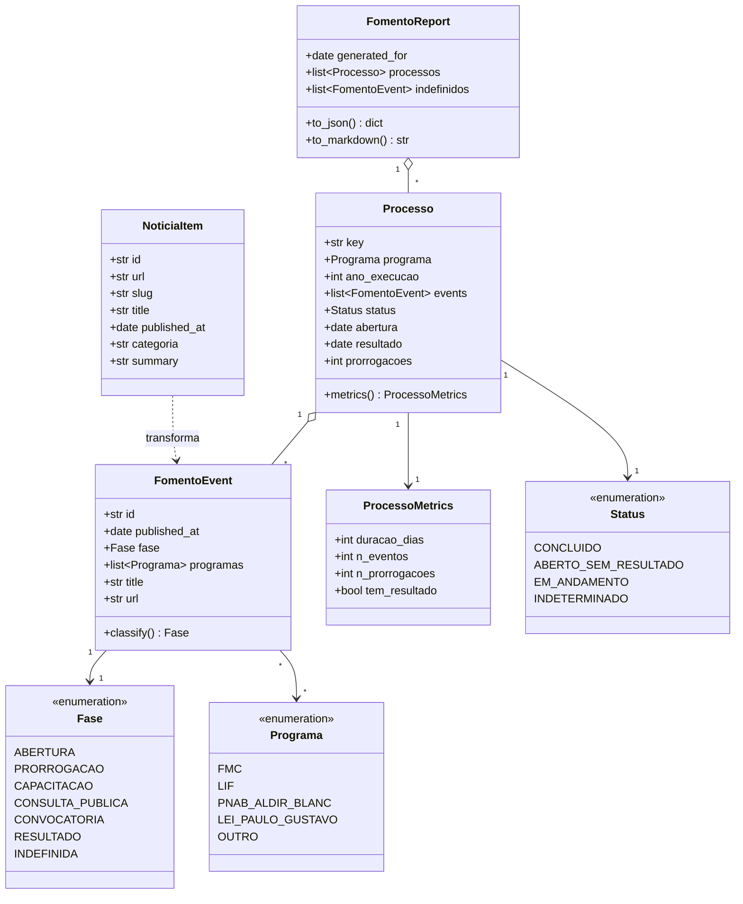
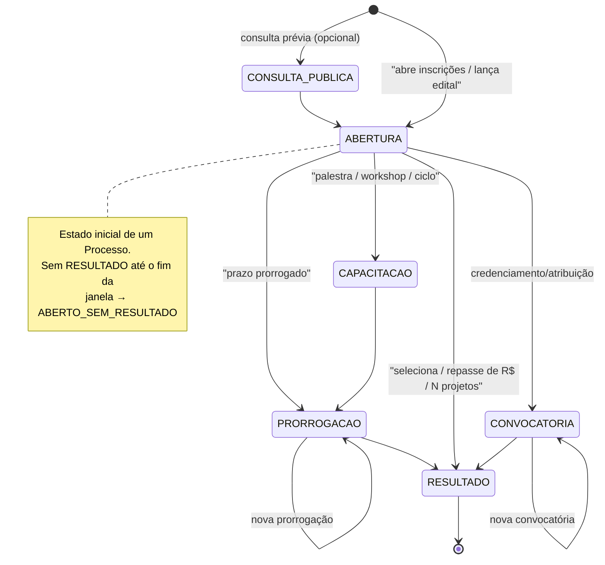
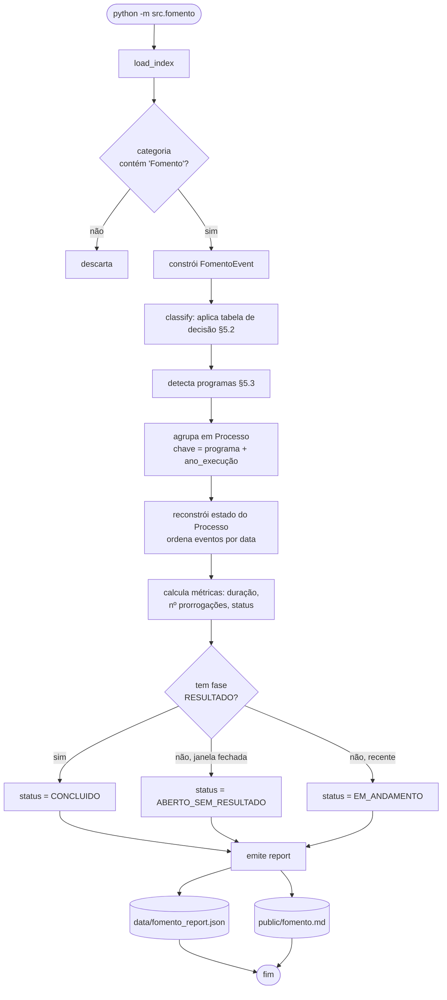
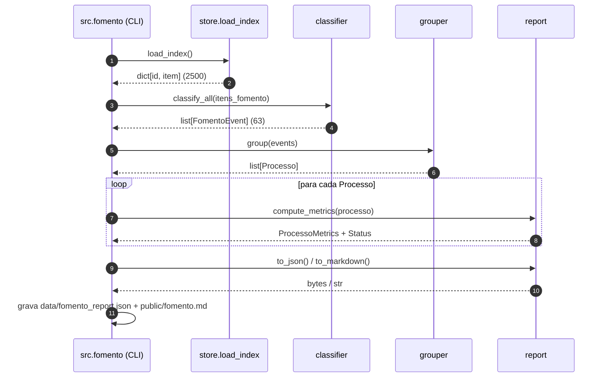
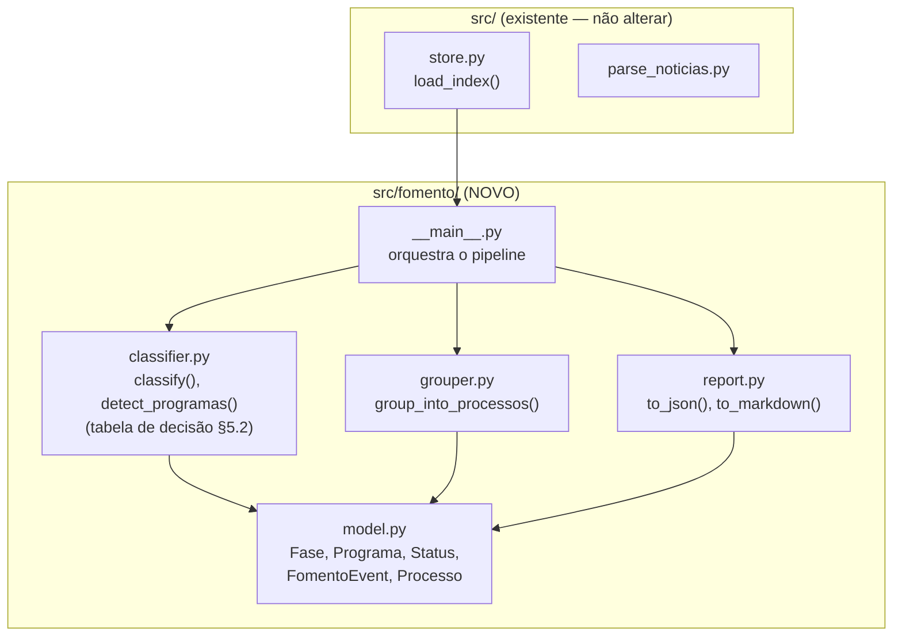
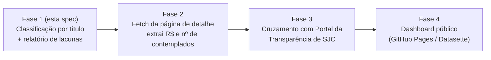

# Especificação Técnica — Radar de Ciclo de Vida dos Editais de Fomento (FCCR)

| Campo | Valor |
|---|---|
| **Identificador** | SPEC-001 |
| **Título** | Radar de Ciclo de Vida dos Editais de Fomento |
| **Versão** | 0.1 (rascunho) |
| **Data** | 2026-05-29 |
| **Autor** | almeidadm |
| **Status** | Proposta |
| **Repositório** | `fccr-scraping` |
| **Módulo proposto** | `src/fomento/` |

---

## 1. Visão geral e motivação

O `fccr-scraping` já mantém um índice de **2.500 publicações** da Fundação Cultural
Cassiano Ricardo (FCCR), das quais **63 estão classificadas como `categoria=Fomento`**.
Essas notícias narram, de forma fragmentada, o ciclo de vida dos editais de recursos
públicos para cultura — abertura, prorrogação, capacitação, seleção e repasse.

Hoje esses fragmentos vivem soltos: não há como, a partir do `index.json`, responder
perguntas de **transparência e controle social** como:

- Quais editais foram **abertos mas nunca tiveram resultado publicado**?
- Qual o **tempo médio** entre abertura de inscrições e divulgação de selecionados?
- Quantas **prorrogações** cada edital sofreu (proxy de qualidade do processo)?
- Quais **valores e quantidade de projetos** foram efetivamente fomentados por programa?

Esta especificação descreve um módulo que **agrupa as publicações de Fomento em
"processos de edital"**, classifica cada publicação em uma **fase de ciclo de vida**,
e emite um relatório de transparência (Markdown + JSON) destacando lacunas e atrasos.

### 1.1 Objetivos (in scope)

- O1. Classificar cada publicação de Fomento numa fase de ciclo de vida.
- O2. Agrupar publicações em **processos** por (programa, ano de execução).
- O3. Calcular métricas por processo: duração, nº de prorrogações, pendências.
- O4. Emitir relatório `data/fomento_report.json` + `public/fomento.md`.
- O5. Integrar ao pipeline existente sem quebrar o scraping de notícias.

### 1.2 Não-objetivos (out of scope nesta versão)

- N1. Parsear o **corpo/PDF** das notícias para extrair valores e nomes de
  contemplados (fase 2 — depende de fetch da página de detalhe).
- N2. Cruzamento com Portal da Transparência de SJC (fase 3).
- N3. Inferência por NLP/ML — a v0.1 usa **regras determinísticas** sobre o título/resumo.

---

## 2. Contexto do sistema (C4 — Nível 1)



**Fronteira do sistema:** o módulo de Fomento é **read-only** sobre o `index.json` já
persistido. Não faz requisições HTTP próprias na v0.1 — desacopla a análise da coleta.

---

## 3. Requisitos

### 3.1 Requisitos funcionais

| ID | Requisito | Prioridade |
|---|---|---|
| RF-01 | O sistema deve ler todos os itens com `categoria` contendo `"Fomento"` do `index.json`. | Must |
| RF-02 | Cada item deve ser classificado em exatamente uma `Fase` (ver §5.1). | Must |
| RF-03 | Cada item deve ser associado a zero ou mais `Programa`s detectados (FMC, LIF, PNAB/Aldir Blanc, Lei Paulo Gustavo, …). | Must |
| RF-04 | Itens devem ser agrupados em `Processo`s por (programa, janela temporal). | Must |
| RF-05 | Para cada processo, calcular: data de abertura, data de resultado, duração, nº de prorrogações, status. | Must |
| RF-06 | Sinalizar processos com `status = ABERTO_SEM_RESULTADO` quando há abertura mas nenhuma fase de resultado dentro da janela. | Must |
| RF-07 | Emitir `data/fomento_report.json` (dado aberto, estável, ordenado). | Must |
| RF-08 | Emitir `public/fomento.md` legível por humanos com tabela de processos e seção de pendências. | Should |
| RF-09 | Itens não-classificáveis devem cair em `Fase.INDEFINIDA` e ser listados num apêndice de revisão. | Should |
| RF-10 | CLI: `python -m src.fomento` gera os relatórios a partir do índice local. | Must |

### 3.2 Requisitos não-funcionais

| ID | Requisito |
|---|---|
| RNF-01 | **Determinismo:** mesma entrada → mesma saída byte-a-byte (ordenação estável, sem timestamps no corpo do dado). |
| RNF-02 | **Offline:** roda sem rede; opera sobre o `index.json` versionado. |
| RNF-03 | **Performance:** < 1 s para 2.500 itens (regras O(n) sobre strings). |
| RNF-04 | **Testabilidade:** classificador puro e sem efeitos colaterais; cobertura sobre fixtures congeladas dos 63 títulos reais de Fomento. |
| RNF-05 | **Transparência da regra:** a heurística de classificação é versionada e auditável (dicionário de padrões em um único módulo). |
| RNF-06 | **Não-regressão:** não altera `parse_noticias`, `store`, `feed`. |

---

## 4. Modelo de dados (diagrama de classes)



---

## 5. Lógica de classificação

### 5.1 Máquina de estados do ciclo de vida do edital

O ciclo de vida idealizado de um edital, e as transições observáveis pelas publicações:



> **Nota:** a máquina acima descreve o *processo real* do edital. A classificação de
> cada publicação (§5.2) é independente e determinística por publicação; a *reconstrução*
> do estado do `Processo` (§6) consome a sequência de fases ordenadas por data.

### 5.2 Heurística de classificação (tabela de decisão)

Regras avaliadas **na ordem de prioridade** (primeira que casar vence). Padrões aplicados
sobre `title + " " + summary` normalizados (minúsculas, sem acento). Derivados dos 63
títulos reais de Fomento.

| Ordem | Fase | Padrões (regex/keywords) | Exemplo real |
|---|---|---|---|
| 1 | `RESULTADO` | `seleciona`, `selecionad`, `repasse`, `\bR\$`, `\d+ projetos`, `aprovad`, `contemplad`, `conquista prêmio` | "LEI ALDIR BLANC: Repasse de R$4,3 mi para 852 projetos" |
| 2 | `PRORROGACAO` | `prorrog` | "Edital Festivais e Mostras do FMC é prorrogado por dez dias" |
| 3 | `CONSULTA_PUBLICA` | `consulta publica` | "FCCR lança consulta pública para definir repasses da Lei Aldir Blanc" |
| 4 | `CONVOCATORIA` | `convocatoria`, `credencia`, `atribuicao`, `cadastramento`, `mapeamento` | "Fundação Cultural credencia novos artistas…" |
| 5 | `CAPACITACAO` | `palestra`, `workshop`, `oficina`, `capacita`, `encontro`, `ciclo` | "FCCR realiza Ciclo de Capacitação da LIF 2021" |
| 6 | `ABERTURA` | `abre inscri`, `abre edital`, `lanca`, `inscricoes vao`, `estao abertas`, `abre.*edital`, `disponibiliza R\$.*editais` | "FCCR abre inscrições para projetos à LIF 2021" |
| 7 | `INDEFINIDA` | (fallback) | "2024 começa com oportunidades no setor cultural" |

> **Conflito conhecido:** "disponibiliza R$ 1,8 mi para 5 editais" indica *abertura* com
> verba alocada, não *resultado*. Por isso a regra de `ABERTURA` (ordem 6) inclui o padrão
> `disponibiliza R\$ .* editais`, e a regra 1 exige `repasse|para \d+ projetos`
> (resultado pago), não apenas a presença de `R$`. Casos-limite vão para fixtures de teste.

### 5.3 Detecção de programa

| Programa | Padrões |
|---|---|
| `FMC` | `\bfmc\b`, `fundo municipal de cultura` |
| `LIF` | `\blif\b`, `lei de incentivo` |
| `PNAB_ALDIR_BLANC` | `aldir blanc`, `\bpnab\b` |
| `LEI_PAULO_GUSTAVO` | `paulo gustavo`, `\blpg\b` |
| `OUTRO` | nenhum dos acima |

Um evento pode citar **múltiplos programas** (ex.: "editais do FMC e da LIF") → lista.

---

## 6. Pipeline de processamento (fluxograma)



### 6.1 Regra de janela temporal (agrupamento em Processo)

A chave do processo é `{programa}:{ano_execucao}`. O `ano_execucao` é derivado do título
quando explícito (ex.: "LIF 2022/23" → 2022), senão do ano de `published_at`. Eventos do
mesmo programa a menos de **180 dias** de distância sem novo `ABERTURA` pertencem ao mesmo
processo (evita que uma prorrogação em janeiro e uma seleção em agosto virem processos
distintos).



---

## 7. Arquitetura de componentes (módulo proposto)



**Princípio de design:** `classifier.py` e `grouper.py` são **funções puras**
(`str/list → dataclass`), sem I/O. Só `__main__.py` toca o sistema de arquivos. Isso
satisfaz RNF-04 (testabilidade) e RNF-01 (determinismo).

### 7.1 Estrutura de arquivos

```
src/fomento/
├── __init__.py
├── __main__.py        # CLI: orquestra load → classify → group → report
├── model.py           # enums + dataclasses (frozen)
├── classifier.py      # regras §5.2 e §5.3 (dicionário de padrões versionado)
├── grouper.py         # agrupamento em Processo + janela temporal §6.1
└── report.py          # serialização JSON + render Markdown
tests/fomento/
├── fixtures/
│   └── fomento_titles.json   # os 63 títulos reais + fase esperada (gabarito)
├── test_classifier.py        # 1 caso por fase + casos-limite §5.2
├── test_grouper.py
└── test_report.py            # snapshot do JSON/MD (RNF-01)
docs/
└── spec_fomento_lifecycle.md # este documento
```

---

## 8. Contrato de saída

### 8.1 `data/fomento_report.json` (dado aberto)

```json
{
  "schema_version": 1,
  "source_index_count": 2500,
  "fomento_event_count": 63,
  "processos": [
    {
      "key": "PNAB_ALDIR_BLANC:2020",
      "programa": "PNAB_ALDIR_BLANC",
      "ano_execucao": 2020,
      "status": "CONCLUIDO",
      "abertura": "2020-10-28",
      "resultado": "2020-12-16",
      "duracao_dias": 49,
      "prorrogacoes": 0,
      "eventos": [
        {"id": "...", "published_at": "2020-10-28", "fase": "ABERTURA",
         "title": "LEI ALDIR BLANC", "url": "https://..."},
        {"id": "...", "published_at": "2020-12-16", "fase": "RESULTADO",
         "title": "LEI ALDIR BLANC: Repasse de R$4,3 mi para 852 projetos", "url": "https://..."}
      ]
    }
  ],
  "indefinidos": [
    {"id": "...", "published_at": "2024-01-03", "title": "2024 começa com oportunidades no setor cultural", "url": "https://..."}
  ]
}
```

> `generated_at` **não** entra no corpo do JSON (vai num arquivo lateral ou no commit),
> para garantir RNF-01: diffs do dataset refletem só mudanças de conteúdo.

### 8.2 `public/fomento.md` (esboço de layout)

```
# FCCR — Ciclo de Vida dos Editais de Fomento

## ⚠️ Pendências (abertos sem resultado publicado)
| Programa | Ano | Aberto em | Dias sem resultado |
|----------|-----|-----------|--------------------|
| ...      | ... | ...       | ...                |

## Processos concluídos
| Programa | Ano | Abertura → Resultado | Duração | Prorrogações |
|----------|-----|----------------------|---------|--------------|

## Apêndice: eventos não classificados (revisão manual)
```

---

## 9. Estratégia de testes

| Nível | Alvo | Técnica |
|---|---|---|
| Unitário | `classify()` | Tabela: 63 títulos reais → fase esperada (gabarito em fixture). Meta: ≥ 90% de acerto, 0 falsos `RESULTADO`. |
| Unitário | `detect_programas()` | Casos com 0, 1 e múltiplos programas. |
| Unitário | `group_into_processos()` | Janela de 180 dias; abertura nova rompe processo. |
| Snapshot | `to_json()` / `to_markdown()` | Saída byte-a-byte estável (RNF-01) sobre o índice congelado. |
| Regressão | pipeline completo | `python -m src.fomento` sobre `tests/fixtures` não altera `index.json`. |

**Matriz de validação do classificador (amostra do gabarito):**

| Título (real) | Fase esperada | Risco |
|---|---|---|
| "FCCR abre inscrições para projetos à LIF 2021" | ABERTURA | — |
| "Prazo para a inscrição de projetos da LIF é prorrogado" | PRORROGACAO | — |
| "FCCR seleciona 32 projetos culturais para a LIF" | RESULTADO | — |
| "Fundo Municipal de Cultural disponibiliza R$ 1,8 mi para 5 editais" | ABERTURA | colisão com regra `R$` |
| "FCCR lança consulta pública para definir repasses…" | CONSULTA_PUBLICA | colisão com `lança`/`repasse` |
| "2024 começa com oportunidades no setor cultural" | INDEFINIDA | ruído editorial |

---

## 10. Riscos e mitigação

| ID | Risco | Impacto | Mitigação |
|---|---|---|---|
| R-01 | Título ambíguo classifica errado (ex.: `R$` em abertura) | Médio | Ordem de regras + gabarito de teste + apêndice de revisão (RF-09). |
| R-02 | Resultado publicado fora da `categoria=Fomento` | Alto | Fase 2: varrer também por programa em todas as categorias; logar cobertura. |
| R-03 | Falso `ABERTO_SEM_RESULTADO` por resultado ainda não publicado | Médio | Status `EM_ANDAMENTO` para janelas recentes (< N meses); só marcar pendência após prazo. |
| R-04 | Mudança no HTML quebra `categoria` upstream | Médio | Módulo é read-only sobre `index.json`; protegido por testes do parser existente. |
| R-05 | Heurística envelhece com novos formatos de título | Baixo | Padrões num único dicionário versionado (RNF-05); revisão via apêndice. |

---

## 11. Roadmap



---

## 12. Critérios de aceitação (Definition of Done)

- [ ] `python -m src.fomento` gera `data/fomento_report.json` e `public/fomento.md`.
- [ ] Os 63 eventos de Fomento são classificados; ≤ 10% caem em `INDEFINIDA`.
- [ ] Nenhum falso positivo de `RESULTADO` no gabarito de teste.
- [ ] Pelo menos a "Lei Aldir Blanc 2020" aparece como `CONCLUIDO` (abertura 28/10/2020 → resultado 16/12/2020).
- [ ] Pendências (`ABERTO_SEM_RESULTADO`) listadas no topo do `fomento.md`.
- [ ] Saída determinística: rodar duas vezes não muda os arquivos.
- [ ] Nenhuma alteração em `parse_noticias.py`, `store.py`, `feed.py`.
- [ ] Cobertura de testes para classifier, grouper e report.

---

## Apêndice A — Glossário

| Termo | Definição |
|---|---|
| **FMC** | Fundo Municipal de Cultura. |
| **LIF** | Lei de Incentivo Fiscal à cultura (municipal). |
| **PNAB** | Política Nacional Aldir Blanc — fomento federal continuado. |
| **Lei Paulo Gustavo** | Lei federal de fomento emergencial à cultura (LC 195/2022). |
| **Processo** | Conjunto de publicações que descrevem o ciclo de um mesmo edital. |
| **Evento** | Uma única publicação de Fomento, classificada numa fase. |
